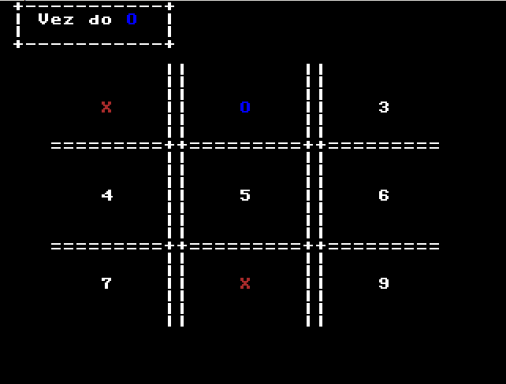

# Jogo-da-Velha-SSC0119

## Trabalho da disciplina SSC0119 - Prática em Organização e Arquitetura de Computadores
O jogo implementado foi o clássico jogo da velha. Os jogadores alternam as jogadas colocando
"X" ou "O" nos quadrados até o jogo velhar ou ser vencido por um deles.

## Telas do jogo

Tela Inicial 

Tela de jogo 

Tela de fim de jogo 

## Membros: 
CHRISTIAN SIMAS GIOIA - 11795572 
BRENO GONCALVES RODRIGUES -  
HENRIQUE SOUZA MARQUES - 11815722  
